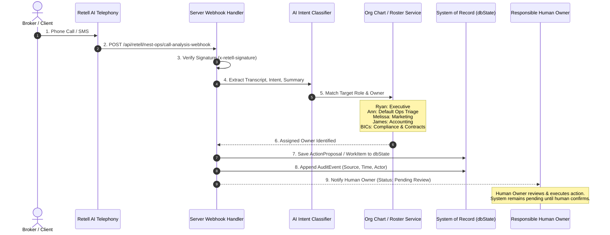
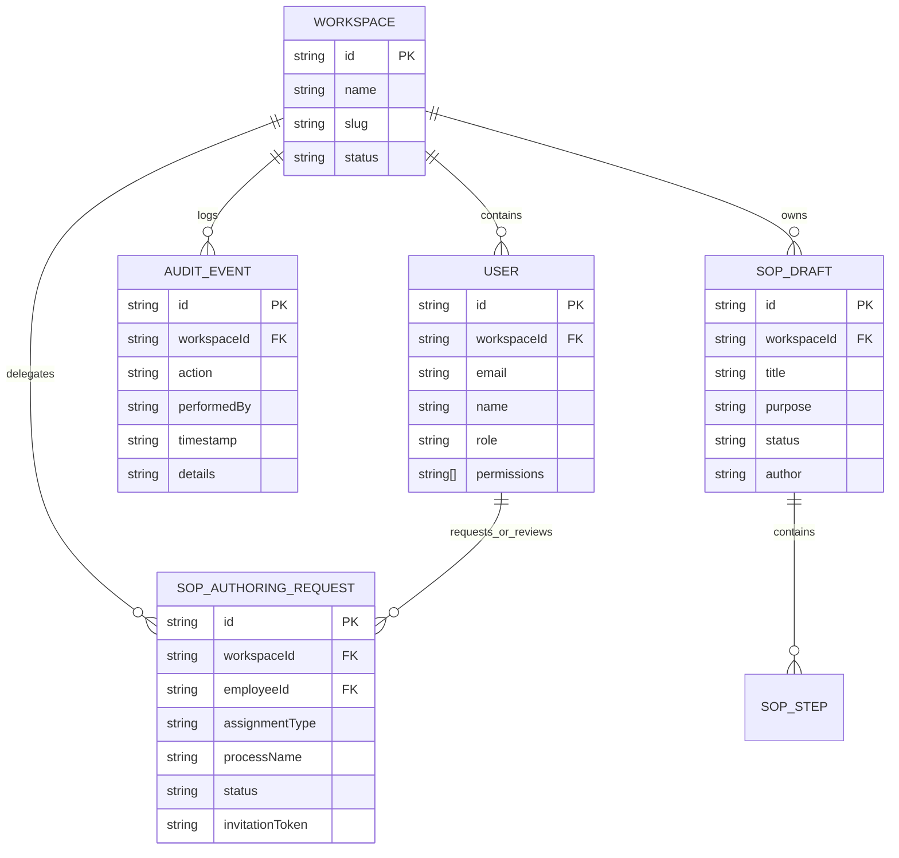
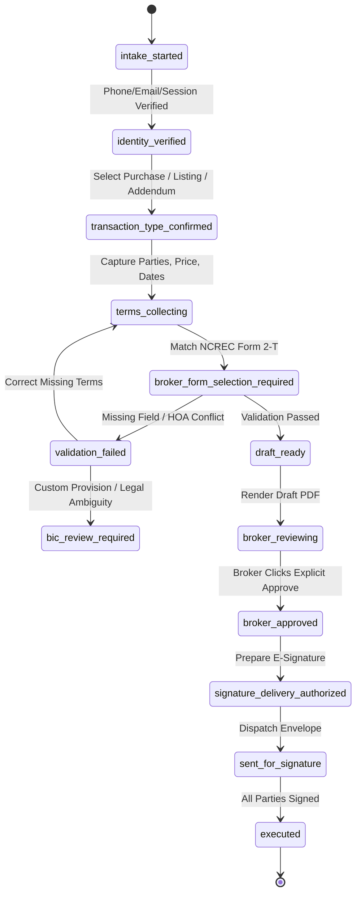

# ASK NEST OPS CONTRACT COPILOT: ARCHITECTURE DISCOVERY REPORT
**Phase 1: Deep Evidence-Based System Discovery & Additive Contract Architecture**  
**Target Workspace:** Nest Realty Wilmington / Coastal NC Pilot (`nest-realty-wilmington`)  
**Date:** August 5, 2026  

---

## 1. Executive Summary

### System State Finding
Shapework is a Node.js Express full-stack SaaS platform featuring an in-memory & file-backed operational engine (`dbState`), custom multi-tenant workspace middleware (`requireAuth`, `resolveWorkspaceContext`, `requireWorkspaceMembership`), and a multi-channel operational intelligence model.

Ask Nest Ops currently functions through two active voice/messaging layers:
1. **Retell AI**: Inbound phone call webhooks (`/api/retell/nest-ops/inbound-webhook`), inbound SMS webhooks (`/api/retell/nest-ops/inbound-sms-webhook`), and post-call analysis processing (`/api/retell/nest-ops/call-analysis-webhook`).
2. **ElevenLabs Conversational AI**: WebRTC token generation (`/api/elevenlabs/conversation-token`), signed WebSocket URLs (`/api/elevenlabs/signed-url`), and client-side `@elevenlabs/client` SDK sessions (`useSopVoiceSession.ts`).

### Feasibility of Contract Copilot
The codebase **can support the proposed Contract Copilot cleanly** as an additive, channel-independent domain layer. However, the system currently lacks licensed North Carolina real estate form definitions (e.g., NCREC Form 2-T), deterministic contract field validation rules, and active third-party form/e-sign provider REST SDK bindings (DocuSign, zipForm, and SkySlope operate via simulated mock endpoints in `/server.ts`).

### Safest Integration Approach
Coexist ElevenLabs and Retell via a **Shared Canonical Contract Intake API** (`/api/contracts/intake-session`). Retell remains the primary operational telephony front door for general inquiries, while ElevenLabs powers interactive, high-fidelity contract instructions via WebRTC or web/app voice sessions. Both voice providers dispatch structured tool calls/webhooks into the single canonical contract intake service.

### Top Blockers / Unknowns
1. **Licensed Forms Provider Access**: No NCREC PDF templates or forms provider API (zipForm / SkySlope Forms) exists in the repository.
2. **E-Signature Provider SDK**: DocuSign endpoints (`/api/ops/integrations/docusign/*`) are mock simulations; production OAuth/REST keys must be provisioned.
3. **Broker Authentication on Telephony**: Inbound phone/SMS identity verification requires mapping caller phone numbers to authenticated Nest broker records before initiating contract drafting sessions.

---

## 2. Current Technology Stack

| Layer | Technology | Version | Evidence Path | Current Responsibility | Confidence Level |
| :--- | :--- | :--- | :--- | :--- | :--- |
| **Frontend Framework** | React | ^18.2.0 | [package.json:L39](file:///Users/marcusaman/Downloads/shapework%20%282%29/package.json#L39) | Single-page UI rendering & interactive consoles | **Confirmed** |
| **Build Tooling** | Vite | ^6.4.3 | [package.json:L68](file:///Users/marcusaman/Downloads/shapework%20%282%29/package.json#L68) | Development server & production bundling | **Confirmed** |
| **Backend Runtime** | Node.js + Express | ^4.18.2 | [server.ts:L6](file:///Users/marcusaman/Downloads/shapework%20%282%29/server.ts#L6) | Master full-stack HTTP server & REST APIs | **Confirmed** |
| **Primary Telephony Voice** | Retell AI | REST API | [server.ts:L7392-L7820](file:///Users/marcusaman/Downloads/shapework%20%282%29/server.ts#L7392-L7820) | Telephony inbound calls, SMS, & post-call analysis | **Confirmed** |
| **Conversational Voice** | ElevenLabs ElevenAgents | `@elevenlabs/client` ^0.1.7 | [server.ts:L7148-L7180](file:///Users/marcusaman/Downloads/shapework%20%282%29/server.ts#L7148-L7180) | Real-time WebRTC/WebSocket voice guide sessions | **Confirmed** |
| **PDF Generation** | jsPDF / html2pdf.js | jspdf ^4.2.1, html2pdf.js ^0.14.0 | [package.json:L43](file:///Users/marcusaman/Downloads/shapework%20%282%29/package.json#L43) | Client & server flyer/report PDF generation | **Confirmed** |
| **Database & Persistence** | In-Memory `dbState` + JSON files | Local / Database driver | [server.ts:L2004](file:///Users/marcusaman/Downloads/shapework%20%282%29/server.ts#L2004) | In-memory audit events, work items, file JSON stores | **Confirmed** |
| **Auth & Isolation** | Custom Express Middleware | Native JWT/Header | [server.ts:L150-L280](file:///Users/marcusaman/Downloads/shapework%20%282%29/server.ts#L150-L280) | Session verification & `workspaceId` tenant scoping | **Confirmed** |
| **E-Signature** | DocuSign (Simulated) | Mock Endpoints | [server.ts:L10722-L11480](file:///Users/marcusaman/Downloads/shapework%20%282%29/server.ts#L10722-L11480) | Audit log simulation for envelope verification & sending | **Inferred** |
| **Transaction Storage** | SkySlope / Dotloop | Catalog Only | [integrationCatalog.ts:L234](file:///Users/marcusaman/Downloads/shapework%20%282%29/src/data/integrationCatalog.ts#L234) | Listed as partner approval required; no active SDK | **Not found** |
| **NC Real Estate Forms** | NCREC Licensed Forms | None | Repository-wide | No Form 2-T or NCREC templates present in codebase | **Not found** |

---

## 3. Current Architecture Diagram

```mermaid
flowchart TD
    subgraph External Systems & Telephony
        A1[Retell AI Telephony Network]
        A2[ElevenLabs Conversational AI]
        A3[Browser / Client HTTP]
    end

    subgraph Server Middleware Layer (server.ts)
        B1[requireAuth]
        B2[resolveWorkspaceContext]
        B3[requireWorkspaceMembership]
    end

    subgraph Ask Nest Ops Core APIs
        C1[Retell Status & Setup: /api/retell/nest-ops/*]
        C2[Retell Inbound Webhooks: /api/retell/nest-ops/inbound-webhook]
        C3[Retell SMS Webhook: /api/retell/nest-ops/inbound-sms-webhook]
        C4[Call Analysis Processor: handleCallAnalysisWebhook]
        C5[ElevenLabs WebRTC Token: /api/elevenlabs/conversation-token]
    end

    subgraph Domain Repositories & Engine
        D1[sopAuthoringRequestRepository]
        D2[sopRepository]
        D3[orgChartService - Nest Roster 72]
        D4[marketingCampaignsRepository]
    end

    subgraph Data & Persistence
        E1[In-Memory dbState: auditEvents, workItems, actionProposals]
        E2[File Storage: data/private/]
    end

    A1 -->|Inbound Call / Webhook| C2
    A1 -->|Inbound SMS / Webhook| C3
    A1 -->|Post-Call Transcript| C4
    A2 -->|WebRTC / Token Req| C5
    A3 -->|HTTP APIs| B1 --> B2 --> B3 --> C1

    C4 -->|Classify & Route| D3
    C4 -->|Create Work Item| E1
    C5 -->|Issue Token| A2
    D1 -->|Save Delegation| E2
    D2 -->|Save SOP Draft| E2
```

---

## 4. Current Ask Nest Ops Request Lifecycle



### Exact Evidence Mapping
- **Entry & Verification**: [server.ts:L7701-L7720](file:///Users/marcusaman/Downloads/shapework%20%282%29/server.ts#L7701-L7720) (`handleCallAnalysisWebhook` verifies `x-retell-signature`).
- **Classification & Routing**: [server.ts:L7740-L7780](file:///Users/marcusaman/Downloads/shapework%20%282%29/server.ts#L7740-L7780) (maps intent to responsible role: Ann Gunn for general triage, Ryan Crecelius for executive, Melissa for marketing, BICs for compliance).
- **Persistence & Audit**: [server.ts:L7790-L7815](file:///Users/marcusaman/Downloads/shapework%20%282%29/server.ts#L7790-L7815) (creates `ActionProposal` and logs `AuditEvent`).
- **Gaps Identified**:
  1. Phone numbers are not currently validated against authenticated user accounts before parsing instructions.
  2. No deterministic validation step exists for contract terms.

---

## 5. Relevant Code and Data Inventory

| File Path | Symbol / Data Structure | Current Purpose | Contract Copilot Relationship | Recommendation | Risk |
| :--- | :--- | :--- | :--- | :--- | :--- |
| [server.ts:L150-L280](file:///Users/marcusaman/Downloads/shapework%20%282%29/server.ts#L150-L280) | `requireAuth`, `requireWorkspaceMembership` | Tenant authentication & workspace isolation | Enforce authenticated broker access | **Reuse as-is** | Low |
| [server.ts:L7392-L7820](file:///Users/marcusaman/Downloads/shapework%20%282%29/server.ts#L7392-L7820) | `handleCallAnalysisWebhook`, Retell routes | Inbound telephony & SMS intake | Telephony front door for general inquiries | **Reuse as-is** (Do not replace) | Medium |
| [server.ts:L7148-L7180](file:///Users/marcusaman/Downloads/shapework%20%282%29/server.ts#L7148-L7180) | `/api/elevenlabs/conversation-token` | ElevenLabs WebRTC session startup | Conversational voice engine for contract instruction | **Extend safely** | Low |
| [sopAuthoringRequestRepository.ts](file:///Users/marcusaman/Downloads/shapework%20%282%29/server/persistence/sopAuthoringRequestRepository.ts) | `SopAuthoringRequest` | Delegated SOP authoring request store | Pattern for broker contract preparation requests | **Extend / Pattern Match** | Low |
| [nestRosterSeed.ts](file:///Users/marcusaman/Downloads/shapework%20%282%29/server/persistence/nestRosterSeed.ts) | `NEST_FULL_ROSTER_72` | 72 Wilmington team member roster & roles | Verify BIC roles (Ryan Crecelius, Eric Knight, etc.) | **Reuse as-is** | Low |
| [NestOpsHub.tsx](file:///Users/marcusaman/Downloads/shapework%20%282%29/src/components/brokerage-ops/NestOpsHub.tsx) | `NestOpsHub` | Operations dashboard & request management | Render broker contract draft workspace | **Extend safely** | Medium |
| [useWorkspaceConsoleState.ts](file:///Users/marcusaman/Downloads/shapework%20%282%29/src/state/useWorkspaceConsoleState.ts) | `useWorkspaceConsoleState` | Workspace state hook | Operations state management | **DO NOT TOUCH** (Restricted) | High |
| [server.ts:L10722-L11480](file:///Users/marcusaman/Downloads/shapework%20%282%29/server.ts#L10722-L11480) | `/api/ops/integrations/docusign/*` | Simulated DocuSign envelope endpoints | Prototype for e-signature delivery authorization | **Replace later** with production SDK | Medium |

---

## 6. Existing Integrations

### 1. Retell AI Telephony
- **Provider**: Retell AI
- **Purpose**: Inbound phone call handling, voice assistant responses, inbound SMS, call transcript analysis.
- **Entry Point**: `https://api.retellai.com` via `callRetellApi` in [server.ts:L7026](file:///Users/marcusaman/Downloads/shapework%20%282%29/server.ts#L7026).
- **Auth Method**: `RETELL_API_KEY` header (`Authorization: Bearer <key>`).
- **Webhook Route**: `POST /api/retell/nest-ops/call-analysis-webhook` and `POST /api/retell/webhook`.
- **Payload Types**: JSON webhook containing `call_id`, `transcript`, `call_analysis` (`custom_analysis_data`, `user_sentiment`).
- **Failure Handling**: Catches exceptions and records error in `(dbState as any).retellSetupErrors`.
- **External Writes**: Creates/updates Retell Agent, LLM, and Knowledge Base resources via API.

### 2. ElevenLabs Conversational AI
- **Provider**: ElevenLabs
- **Purpose**: High-fidelity real-time voice conversations via WebRTC/WebSocket.
- **Entry Point**: `POST /api/elevenlabs/conversation-token` in [server.ts:L7153](file:///Users/marcusaman/Downloads/shapework%20%282%29/server.ts#L7153).
- **Auth Method**: `ELEVENLABS_API_KEY` (`xi-api-key` header).
- **Payload Types**: Returns short-lived WebRTC token (`conversationToken`).
- **External Writes**: None directly from server endpoint; client opens WebRTC peer connection.

### 3. DocuSign Integration (Simulated)
- **Provider**: DocuSign (Simulated Mock)
- **Purpose**: Signature audit verification, BIC compliance sign-off, envelope sending simulation.
- **Entry Points**: `/api/ops/integrations/docusign/verify`, `/approve`, `/send`, `/audit` in [server.ts:L10722-L11480](file:///Users/marcusaman/Downloads/shapework%20%282%29/server.ts#L10722-L11480).
- **Auth Method**: Simulated internal session check (`requireAuth`).
- **External Writes**: None. Appends mock event logs to `dbState.auditEvents`.

### 4. SkySlope / Dotloop / zipForm (Catalog Only)
- **Provider**: SkySlope, Dotloop, zipForm
- **Status**: Catalog records only in [integrationCatalog.ts:L234](file:///Users/marcusaman/Downloads/shapework%20%282%29/src/data/integrationCatalog.ts#L234). Marked as `partner_approval_required`. No active REST SDK bindings.

---

## 7. Existing Data Model



---

## 8. Authentication, Authorization and Tenant Isolation

### Identity & Access Controls
1. **User Authentication**: Handled via session tokens or auth header parsed by `requireAuth` in [server.ts:L150](file:///Users/marcusaman/Downloads/shapework%20%282%29/server.ts#L150).
2. **Tenant Scoping**: All routes enforce `workspaceId` matching through `resolveWorkspaceContext` and `requireWorkspaceMembership`. Workspace `nest-realty-wilmington` isolates Wilmington Coastal NC pilot data.
3. **BIC Role Verification**: Org-chart service and roster seed ([nestRosterSeed.ts](file:///Users/marcusaman/Downloads/shapework%20%282%29/server/persistence/nestRosterSeed.ts)) identify Broker-in-Charge roles (Ryan Crecelius, Eric Knight, Jessica Keenan).
4. **Telephony Identity Gap**: Inbound Retell webhooks currently parse phone numbers as strings but do not perform cryptographic caller verification against authenticated Nest broker records before initiating actions.

---

## 9. Contract Copilot Reuse and Gap Analysis

### Reuse As-Is
- Express backend middleware (`requireAuth`, `resolveWorkspaceContext`, `requireWorkspaceMembership`).
- Org-chart roster service (`nestRosterSeed.ts`) for BIC identification and escalation.
- ElevenLabs WebRTC token endpoint (`POST /api/elevenlabs/conversation-token`).
- Token invitation security model (`sopAuthoringRequestRepository.ts`).

### Extend Safely
- `NestOpsHub.tsx`: Add a dedicated **Contract Drafts** tab for broker review and approval.
- Audit logging (`dbState.auditEvents`): Add contract drafting audit action types (`contract_intake_started`, `contract_validation_failed`, `bic_review_escalated`, `broker_approved`).

### Missing Capability (Must Be Introduced Additively)
1. **Contract Intake Domain Schema**: Structured transaction data model (`ContractIntakeSession`, `ContractField`, `FormSelection`).
2. **Licensed NC Real Estate Forms Registry**: Immutable registry of versioned NCREC forms (Form 2-T, Form 12-T, etc.) with effective/retirement dates.
3. **Deterministic Contract Validation Engine**: Policy engine checking earnest money deadlines, due diligence periods, missing disclosures, and HOA conflicts.
4. **Strict Guardrail Rules**: Hard stop preventing custom legal clauses, legal advice, or wiring instruction dispatches.
5. **Broker Approval Event Pipeline**: Required explicit human click event before contract files can be exported or sent for e-signature.

---

## 10. Recommended Target Architecture

```mermaid
flowchart TD
    subgraph Multi-Channel Intake Adapters
        A1[Retell Telephony Voice/SMS Adapter]
        A2[ElevenLabs WebRTC Voice Adapter]
        A3[Email Intake Adapter]
        A4[Nest Ops Hub Web Adapter]
    end

    subgraph Identity & Authorization Gateway
        B1[Broker Identity Verifier]
        B2[Tenant & Workspace Scoper: nest-realty-wilmington]
        B3[BIC Permission Enforcer]
    end

    subgraph Canonical Contract Intake API (Additive)
        C1[POST /api/contracts/intake-session]
        C2[POST /api/contracts/extract-terms]
        C3[POST /api/contracts/validate]
    end

    subgraph Deterministic Contract Engine (Additive)
        D1[NC Licensed Forms Registry: Form 2-T, Form 12-T]
        D2[Deterministic Validation & Policy Rules]
        D3[Guardrail Stop: No Custom Clauses / Wiring Rules]
        D4[BIC & Legal Escalation Router]
    end

    subgraph Broker Review Workspace & System of Record
        E1[Nest Ops Hub: Contract Review Workspace]
        E2[Explicit Broker Approval Event]
        E3[Audit & Provenance Ledger]
        E4[Licensed Forms Generator Adapter]
        E5[DocuSign / E-Sign Adapter]
    end

    A1 --> B1
    A2 --> B1
    A3 --> B1
    A4 --> B1

    B1 --> B2 --> B3 --> C1
    C1 --> C2 --> D2
    C2 --> D1
    D2 -->|Validation Passed| C3
    D2 -->|HOA/Legal Conflict| D4 -->|Escalate| E1
    D3 -->|Violation Detected| D4
    C3 --> E1
    E1 -->|Broker Clicks Approve| E2
    E2 --> E3
    E2 --> E4
    E2 --> E5
```

---

## 11. Retell and ElevenLabs Coexistence Recommendation

### Recommended Option: Shared Backend with Separate Channel Adapters (Option 3)
- **Retell AI**: Remains the primary telephony front door for general inbound calls, SMS inquiries, and operational triage.
- **ElevenLabs ElevenAgents**: Powers interactive, high-fidelity contract self-authoring voice sessions via WebRTC (`/api/elevenlabs/conversation-token`).
- **Coexistence Mechanism**: When a caller on Retell expresses intent to prepare a contract ("I need to write an offer for 123 Main St"), Retell dispatches a tool webhook to `/api/contracts/intake-session`. The server validates the broker's identity, creates a `ContractIntakeSession`, and SMS/emails a secure ElevenLabs WebRTC session link to the broker's authenticated mobile device.
- **Canonical Persistence**: Both channels write to the single canonical `ContractIntakeSession` record.

---

## 12. Proposed Contract Workflow State Machine



---

## 13. Risk Register

| Risk | Severity | Likelihood | Existing Control | Recommended Architectural Control | Human Owner |
| :--- | :--- | :--- | :--- | :--- | :--- |
| **Unauthorized Practice of Law** | Critical | Low | System prompt instructions | Hard-coded schema restriction blocking non-standard legal clauses | BIC (Ryan / Eric) |
| **Outdated Form Version Usage** | High | Medium | None | Form Registry with effective/retirement dates & immutable version IDs | Compliance Officer |
| **Wiring Fraud Exposure** | Critical | Low | None | Complete system block on wiring instruction processing or transmission | Operations Lead |
| **Premature E-Sign Dispatch** | High | Low | Manual-first pilot rules | Mandatory explicit Broker Approval click event before e-sign call | Broker-in-Charge |
| **Unauthenticated Phone Intake** | High | Medium | Retell webhook signature | Caller phone number verification against authenticated broker directory | System Admin |
| **Cross-Tenant Data Exposure** | Critical | Low | `requireWorkspaceMembership` | Enforce `workspaceId: nest-realty-wilmington` on all contract routes | Lead Architect |

---

## 14. Test Strategy

1. **Unit Tests**: Schema validation for `ContractIntakeSession`, deterministic rule validation (due diligence date $\le$ settlement date, earnest money $\le$ purchase price).
2. **Guardrail Tests**: Assert prompt injection attempts to add custom legal clauses or wiring instructions trigger immediate BIC escalation.
3. **Idempotency & Webhook Tests**: Re-send duplicate Retell/ElevenLabs webhooks to verify no duplicate contract sessions are spawned.
4. **End-to-End Sandbox Scenarios**:
   - Broker calls in instruction $\rightarrow$ Draft populated $\rightarrow$ Validation passes $\rightarrow$ Broker approves $\rightarrow$ Audit trail logged.

---

## 15. Phased Build Plan

- **Phase 0 — Compliance & Provider Confirmation**: Confirm NCREC form licensing, e-sign API access, and BIC approval policies. *(Small)*
- **Phase 1 — Channel-Independent Contract Domain**: Implement `ContractIntakeSession` schema, state machine, and deterministic validator. *(Medium)*
- **Phase 2 — Text & Email Intake Adapters**: Inbound text/email parsing into contract intake sessions with broker review link. *(Medium)*
- **Phase 3 — ElevenLabs Voice Contract Intake**: WebRTC contract intake session guide with critical-term readback. *(Medium)*
- **Phase 4 — Licensed Forms & E-Sign Integration**: PDF population and DocuSign/SignNow REST API integration. *(Large)*
- **Phase 5 — Wilmington Pilot**: Deploy to 5–10 Nest Wilmington brokers with 100% BIC review requirement. *(Medium)*

---

## 16. Questions and Blockers

1. **Licensed Forms Access**: What software/API currently hosts Nest Realty's licensed NCREC Form 2-T templates (e.g. zipForm, SkySlope Forms, or custom PDF templates)?
2. **E-Signature Provider API**: Which e-signature platform (DocuSign, SignNow, Dotloop) will provide production API credentials for the pilot?
3. **Telephony Number Binding**: Should the existing Retell phone number (`910-571-2817`) handle contract intake routing or should a dedicated contract line be provisioned?
