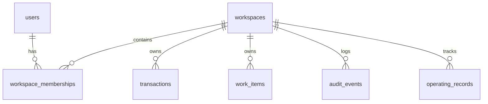

# database-schema.md

This document defines the relational database schema design for **shapework.**. When `STORAGE_DRIVER=database` is configured, these tables are initialized and queried in PostgreSQL.

---

## 1. Schema Diagram Overview

---

## 2. Table Definitions

All customer-owned tables include the core fields:
* `id` VARCHAR(100) PRIMARY KEY
* `workspace_id` VARCHAR(100) NOT NULL REFERENCES workspaces(id) ON DELETE CASCADE
* `created_at` TIMESTAMPTZ NOT NULL DEFAULT NOW()
* `updated_at` TIMESTAMPTZ NOT NULL DEFAULT NOW()

### Core Tables

#### 1. `workspaces`
* `id` VARCHAR(100) PRIMARY KEY
* `name` VARCHAR(255) NOT NULL
* `slug` VARCHAR(255) UNIQUE NOT NULL
* `industry` VARCHAR(100) DEFAULT 'real_estate_brokerage'
* `status` VARCHAR(50) DEFAULT 'active'
* `phase` VARCHAR(50) DEFAULT 'setup'
* `timezone` VARCHAR(100) DEFAULT 'America/New_York'
* `launch_mode` VARCHAR(100) DEFAULT 'integration_first'
* `launch_owner` VARCHAR(255)
* `target_go_live_date` DATE

#### 2. `users`
* `id` VARCHAR(100) PRIMARY KEY
* `email` VARCHAR(255) UNIQUE NOT NULL
* `name` VARCHAR(255) NOT NULL
* `password_hash` VARCHAR(255)
* `status` VARCHAR(50) DEFAULT 'active'

#### 3. `workspace_memberships`
* `id` VARCHAR(100) PRIMARY KEY
* `workspace_id` VARCHAR(100) REFERENCES workspaces(id) ON DELETE CASCADE
* `user_id` VARCHAR(100) REFERENCES users(id) ON DELETE CASCADE
* `role` VARCHAR(100) NOT NULL
* `permissions` TEXT[] NOT NULL

#### 4. `operating_records`
* `id` VARCHAR(100) PRIMARY KEY
* `workspace_id` VARCHAR(100) REFERENCES workspaces(id)
* `business_name` VARCHAR(255)
* `vertical` VARCHAR(100)
* `status` VARCHAR(50)
* `workflow_map_ids` TEXT[]
* `system_map_ids` TEXT[]
* `quick_win_ids` TEXT[]
* `build_sprint_ids` TEXT[]

#### 5. `role_ownership`
* `id` VARCHAR(100) PRIMARY KEY
* `workspace_id` VARCHAR(100) REFERENCES workspaces(id)
* `responsibility_title` VARCHAR(255) NOT NULL
* `primary_owner_role` VARCHAR(100)
* `backup_owner_role` VARCHAR(100)
* `sla` VARCHAR(255)
* `escalation_rule` VARCHAR(255)
* `current_pain_level` VARCHAR(50)
* `notes` TEXT
* `ownership_status` VARCHAR(50)

#### 6. `workflow_templates`
* `id` VARCHAR(100) PRIMARY KEY
* `workspace_id` VARCHAR(100) REFERENCES workspaces(id)
* `name` VARCHAR(255) NOT NULL
* `description` TEXT
* `trigger_event` VARCHAR(255)
* `category` VARCHAR(100)
* `steps` JSONB

#### 7. `active_workflows`
* `id` VARCHAR(100) PRIMARY KEY
* `workspace_id` VARCHAR(100) REFERENCES workspaces(id)
* `template_id` VARCHAR(100) REFERENCES workflow_templates(id)
* `status` VARCHAR(50) DEFAULT 'running'
* `current_step_index` INTEGER DEFAULT 0

#### 8. `opportunities`
* `id` VARCHAR(100) PRIMARY KEY
* `workspace_id` VARCHAR(100) REFERENCES workspaces(id)
* `title` VARCHAR(255) NOT NULL
* `estimated_hours_saved` NUMERIC(6, 2)
* `complexity` VARCHAR(50)
* `status` VARCHAR(50)

#### 9. `quick_wins`
* `id` VARCHAR(100) PRIMARY KEY
* `workspace_id` VARCHAR(100) REFERENCES workspaces(id)
* `title` VARCHAR(255) NOT NULL
* `impact` VARCHAR(255)
* `status` VARCHAR(50)

#### 10. `build_sprints`
* `id` VARCHAR(100) PRIMARY KEY
* `workspace_id` VARCHAR(100) REFERENCES workspaces(id)
* `title` VARCHAR(255) NOT NULL
* `duration_weeks` INTEGER
* `status` VARCHAR(50)

#### 11. `transactions`
* `id` VARCHAR(100) PRIMARY KEY
* `workspace_id` VARCHAR(100) REFERENCES workspaces(id)
* `property_address` TEXT NOT NULL
* `client_name` VARCHAR(255) NOT NULL
* `buyer_or_seller` VARCHAR(50) NOT NULL
* `responsible_agent_id` VARCHAR(100)
* `transaction_coordinator_id` VARCHAR(100)
* `current_stage` VARCHAR(100)
* `expected_closing_date` DATE NOT NULL
* `health_score` INTEGER DEFAULT 100
* `risk_level` VARCHAR(50) DEFAULT 'healthy'
* `outstanding_milestones_count` INTEGER DEFAULT 0
* `latest_update` TEXT
* `source_system` VARCHAR(50)

#### 12. `transaction_checklists`
* `id` VARCHAR(100) PRIMARY KEY
* `workspace_id` VARCHAR(100) REFERENCES workspaces(id)
* `title` VARCHAR(255) NOT NULL
* `status` VARCHAR(50)
* `category` VARCHAR(100)
* `evidence` TEXT
* `property` VARCHAR(255)
* `due_date` DATE

#### 13. `work_items`
* `id` VARCHAR(100) PRIMARY KEY
* `workspace_id` VARCHAR(100) REFERENCES workspaces(id)
* `type` VARCHAR(100) NOT NULL
* `title` VARCHAR(255) NOT NULL
* `source` VARCHAR(100) NOT NULL
* `related_type` VARCHAR(100)
* `related_id` VARCHAR(100)
* `related_label` VARCHAR(255)
* `assigned_to_role` VARCHAR(100) NOT NULL
* `priority` VARCHAR(50) NOT NULL
* `status` VARCHAR(50) NOT NULL
* `recommended_next_action` TEXT
* `approval_required` BOOLEAN DEFAULT FALSE

#### 14. `approvals`
* `id` VARCHAR(100) PRIMARY KEY
* `workspace_id` VARCHAR(100) REFERENCES workspaces(id)
* `title` VARCHAR(255) NOT NULL
* `status` VARCHAR(50) NOT NULL
* `proposed_action` TEXT

#### 15. `approval_events`
* `id` VARCHAR(100) PRIMARY KEY
* `workspace_id` VARCHAR(100) REFERENCES workspaces(id)
* `approval_id` VARCHAR(100) REFERENCES approvals(id)
* `actor_user_id` VARCHAR(100) REFERENCES users(id)
* `action` VARCHAR(50) NOT NULL
* `comment` TEXT

#### 16. `audit_events`
* `id` VARCHAR(100) PRIMARY KEY
* `workspace_id` VARCHAR(100) REFERENCES workspaces(id)
* `timestamp` TIMESTAMPTZ DEFAULT NOW() NOT NULL
* `user_name` VARCHAR(255)
* `user_role` VARCHAR(100)
* `action_description` TEXT NOT NULL
* `impact_area` VARCHAR(100)

#### 17. `integration_connections`
* `id` VARCHAR(100) PRIMARY KEY
* `workspace_id` VARCHAR(100) REFERENCES workspaces(id)
* `name` VARCHAR(100) NOT NULL
* `connected` BOOLEAN DEFAULT FALSE NOT NULL
* `last_sync` TIMESTAMPTZ
* `permissions_granted` TEXT[]
* `records_synchronized` INTEGER DEFAULT 0
* `errors_count` INTEGER DEFAULT 0

#### 18. `integration_events`
* `id` VARCHAR(100) PRIMARY KEY
* `workspace_id` VARCHAR(100) REFERENCES workspaces(id)
* `source` VARCHAR(100) NOT NULL
* `payload` JSONB
* `processed` BOOLEAN DEFAULT FALSE

#### 19. `import_runs`
* `id` VARCHAR(100) PRIMARY KEY
* `workspace_id` VARCHAR(100) REFERENCES workspaces(id)
* `source` VARCHAR(100) NOT NULL
* `status` VARCHAR(50) NOT NULL
* `records_imported` INTEGER DEFAULT 0

#### 20. `pilot_success_criteria`
* `id` VARCHAR(100) PRIMARY KEY
* `workspace_id` VARCHAR(100) REFERENCES workspaces(id)
* `metric_name` VARCHAR(255) NOT NULL
* `target_value` VARCHAR(100)
* `current_value` VARCHAR(100)
* `is_met` BOOLEAN DEFAULT FALSE

#### 21. `daily_check_ins`
* `id` VARCHAR(100) PRIMARY KEY
* `workspace_id` VARCHAR(100) REFERENCES workspaces(id)
* `check_in_date` DATE NOT NULL
* `summary` TEXT

#### 22. `launch_packs`
* `id` VARCHAR(100) PRIMARY KEY
* `workspace_id` VARCHAR(100) REFERENCES workspaces(id)
* `export_date` TIMESTAMPTZ DEFAULT NOW() NOT NULL
* `details` JSONB
