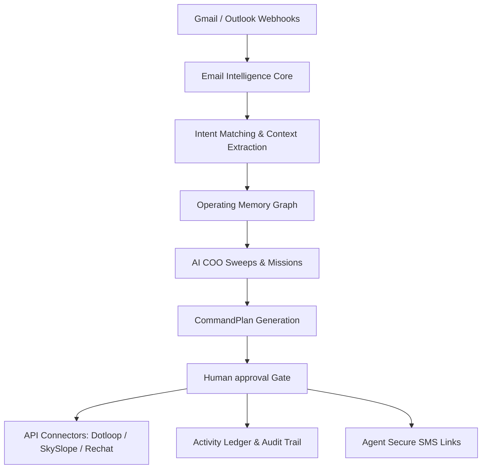

# shapework. Product Architecture

This document outlines the core architecture of **shapework.**, the AI operating layer for real-estate brokerages.

## Core Components

### 1. Operating Memory
Operating Memory acts as the contextual knowledge graph for the brokerage. It links:
* **People**: Roster agents, transaction coordinators, external escrow agents, buyers, sellers, and lenders.
* **Properties**: Listings, escrows, and active buyer files.
* **Documents**: Seller disclosures, lead-based paint addenda, appraisal reports, and commission sheets.
* **Communications**: Email logs, SMS histories, and task checklists.

Operating Memory resolves ambiguous emails (e.g. "I sent the disclosure on Baker") to precise entities ("221 B Baker Street contract file") by matching names and contexts in the active folder database.

### 2. AI COO Missions
Missions are scheduled background agents that proactively inspect the brokerage database for anomalies and operational risk:
* **Closing Risk Sweep**: Scans escrows set to close within 14 days for appraisal alerts, title wire status failures, or missing escrow check-offs.
* **Listing Launch Sweep**: Audits properties launching within 7 days for scheduled photographers, completed MLS syndication copy, and signed disclosures.
* **Agent Support Sweep**: Reviews active agent queues to identify who is blocked or requires additional coordination help.

### 3. Email Intelligence Core
The ingestion pipeline that parses, filters, and logs incoming communication without human reading:
* Matches incoming addresses to roster agents or lenders.
* Classifies the primary operational intent.
* Maps references to active property profiles.
* Auto-triggers staging status drafts (e.g. Clear to Close).

### 4. CommandPlan Engine
The central mechanism that translates natural language commands into a checklist of actions:
* Simulates proposed actions (Dry-Run mode).
* Identifies required integrations and scopes.
* Displays estimated time saved.
* Prompts the COO or coordinator for approval before any external side-effect is executed.

### 5. human-in-the-loop (HITL) Approval System
A robust gatekeeper that enforces:
* **Low Confidence Reviews**: Any classification score below 85% is blocked from auto-updating and sent to the coordinator resolution workbench.
* **Sensitive Action Safeguards**: Financial wire checks, broker listing approvals, and external customer correspondence always require manual double-key authorization.

### 6. Activity Ledger & Audit Trail
Every single stage transition, email draft generation, and integration sync is recorded in an immutable ledger:
* Records actor, evidence, confidence, and system state before/after.
* Provides single-click **Rollback** to undo state transitions in connected database records.
