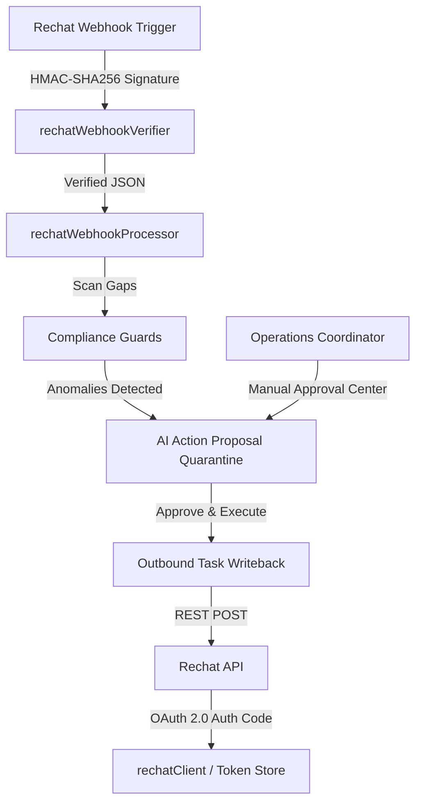

# Rechat Partner Integration (Phase 1)

This document describes the design, architecture, and operation of the Rechat Partner Integration in the shapework. portal.

---

## 1. Technical Architecture Overview

The integration bridges shapework's local **Operating Memory** and real-time coordinator compliance guards with the **Rechat API & Webhooks** platform:

### Components:
- **`rechatClient.ts`**: Standardizes HTTP API calls with token refresh wrappers and automated mock fallbacks if credentials are not configured.
- **`rechatTokenStore.ts`**: Sever-side token storage. Currently manages credentials in-memory for sandboxing.
- **`rechatAuth.ts`**: Provides CSRF state validation during OAuth redirection.
- **`rechatWebhookVerifier.ts`**: Verifies HMAC-SHA256 signatures on incoming webhook bodies.
- **`rechatWebhookProcessor.ts`**: Resolves thin payloads, normalizes structures, and triggers compliance guards.

---

## 2. Webhook Verification & Processing

Webhooks ingest real-time events on **Deals**, **Contacts**, and **Showings** at `/api/integrations/rechat/webhook`:
1. **HMAC Signature Check**: Reconstructs the raw request body and computes a `sha256` signature using `process.env.RECHAT_WEBHOOK_SECRET`.
2. **Timing-Safe Comparison**: Utilizes `crypto.timingSafeEqual` to avoid timing side-channel exploits. Rejecting unverified signatures immediately.
3. **Payload Resolution**: Rather than operating on thin event objects directly, the processor queries `rechatClient` to retrieve the complete up-to-date record detail.

---

## 3. Compliance Guardrails

### A. Deal Intake Guard
- **Trigger**: Webhook topic `Deals` indicates stage transition to `under_contract`.
- **Anomalies Audited**:
  - `missing intake form` (Checks if metadata form checkoff is absent).
  - `missing coordinator` (Checks if no Transaction Coordinator role is assigned).
- **Outbound Action**: Creates a quarantined proposed action: `Create Rechat Task: Submit Brokerage Intake Form`.

### B. Closing Compliance Guard
- **Trigger**: Deal expected closing date is within 15 days.
- **Anomalies Audited**:
  - `missing transaction file` (Checks if executed sales contracts or disclosures are uploaded).
- **Outbound Action**: Creates a quarantined proposed action: `Create Rechat Task: Verify Executed Closing Files`.

---

## 4. Approval-Gated Outbound Writebacks

All write/update operations directed at Rechat (such as task insertion or contact updates) are **strictly quarantined**:
1. Shapework creates an `OutboundAction` proposal in `dbState.actionProposals` marked as `awaiting_approval`.
2. The coordinator inspects the action detail drawer, reviewing the why-recommends reason, evidence context, and assignee.
3. If approved, the backend executes `rechatClient.createTask`, stores the resulting Rechat task ID in `dbState.tasks`, and appends an entry to the audit log.

---

## 5. Verification & Testing

### A. Manual Baseline Sync
- Navigate to the **Brokerage Connector Catalog** (`/demo?tab=Integrations`).
- Click **Connect Account** to execute the OAuth redirect loop.
- Once connected, click **Sync Database** to pull current deals, contacts, and tasks.

### B. Webhook Signature Simulation
- Open the Rechat integration drawer.
- Select the **Webhooks** tab.
- Choose a topic (e.g. `Deals`), type a target record ID, and click **Send Signed Test Webhook**.
- Open the **Audit Logs** or **Pending Approvals** tab to observe the signature verification log, the Deal Intake Guard analysis, and the generated writeback proposal.
