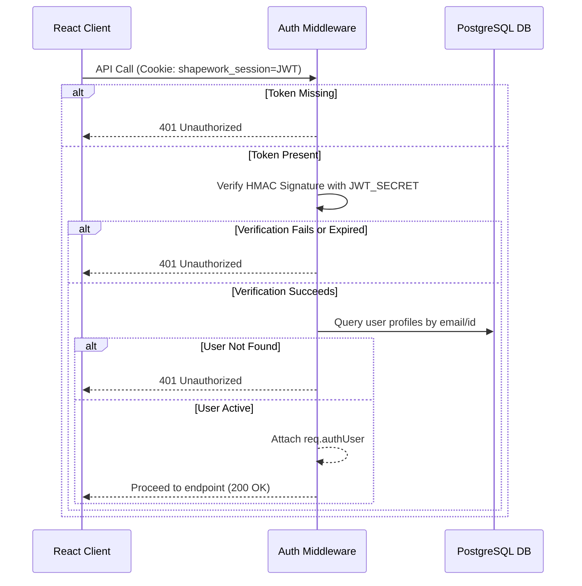

# auth-migration-plan.md

This document details the transition from mock session validation to secure, cryptographically verified JSON Web Token (JWT) authentication backed by browser cookies.

---

## 1. Chosen Strategy: Custom JWT with secure HttpOnly cookies

To achieve absolute verification without relying on external cloud endpoints (which may fail in air-gapped pilot settings), we implement a zero-dependency custom JWT sign/verify system using Node.js's native `crypto` module.

### Advantages
* **Cryptographic Verification**: Prevents token tempering or user ID spoofing.
* **XSS Protection**: Storing the token in a secure `HttpOnly` cookie prevents malicious JavaScript from reading it.
* **Auto-inclusion**: Browsers automatically attach cookies to API endpoints without requiring manual React state extraction.

---

## 2. Token & Session Model

The JWT contains the following payload format:
```json
{
  "userId": "usr_owner_12345",
  "email": "owner@acme.com",
  "role": "owner",
  "exp": 1782860000
}
```

* **Expiration**: Enforced at 1 hour (3600 seconds) from issue time.
* **Signature**: Generated via HMAC-SHA256 using the environment variable `JWT_SECRET`.

---

## 3. Server Verification Flow



---

## 4. Frontend & Session Lifecycle

### Login Flow
1. User enters email (and password) on `/login` form.
2. Form submits to `/api/auth/login`.
3. Server verifies email. If correct, generates JWT and attaches header:
   `Set-Cookie: shapework_session=<JWT>; HttpOnly; Secure; SameSite=Strict; Path=/; Max-Age=3600`
4. Server responds with `{ success: true, user }`.
5. Frontend updates React state `activeProfile` and stores selected workspace in `localStorage` as layout preference (not authorization trust source).

### Logout Flow
1. User clicks Logout.
2. Frontend calls `/api/auth/logout`.
3. Server resets the cookie:
   `Set-Cookie: shapework_session=; HttpOnly; Secure; SameSite=Strict; Path=/; Max-Age=0`
4. Client-side state is completely cleared, and browser redirects to `/login`.

---

## 5. Environment Configuration

The following variables must be configured:
* `JWT_SECRET`: Cryptographically strong random key (at least 32 characters long).
* `AUTH_PROVIDER_CONFIGURED`: Must be set to `"true"` in production mode.
