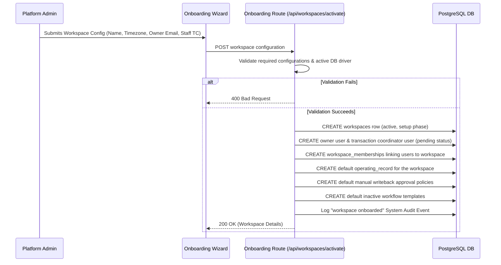

# workspace-onboarding-auth-flow.md

This document outlines the step-by-step onboarding, provision routing, and authorization setup sequence when activating a new workspace tenant in **shapework.**.

---

## 1. Onboarding API Sequence

---

## 2. Invitation & Pending User State

In compliance with the customer pilot safety gate guidelines:
* **No Plaintext Session Keys**: Workspace creation does NOT generate a static/plaintext access key or auto-authenticated bearer session.
* **Pending Status**: The invited owner/coordinator records are flagged as `active` in the users registry but have `password_hash = null`.
* **Login Trigger**: The owner must navigate to the console login screen and sign in via email to generate a custom cryptographically verified session token.

---

## 3. Post-Activation Database Verification

To verify that the onboarding process correctly propagated all tables, check that the following records exist in PostgreSQL:
1. `workspaces`: Contains the newly created workspace slug (e.g. `acme-realty`).
2. `users`: Owner and TC profiles linked to their email addresses.
3. `workspace_memberships`: Roles assigned (e.g., `owner`, `transaction_coordinator`) mapped with correct permission scopes.
4. `operating_records`: Workspace blueprint initialized in the `discovery` status.
5. `approvals`: Outbound approval safeguards connections set to manual gating.
6. `workflow_templates`: Listing and Financing workflows seeded for the workspace.
